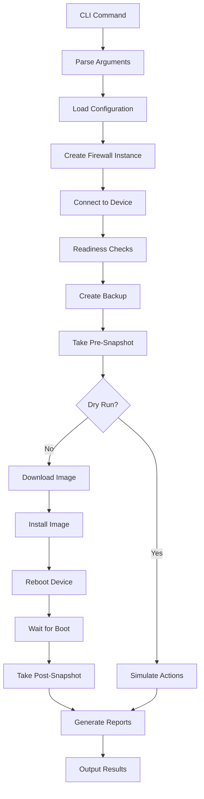
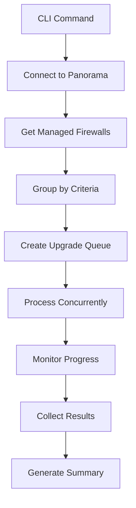
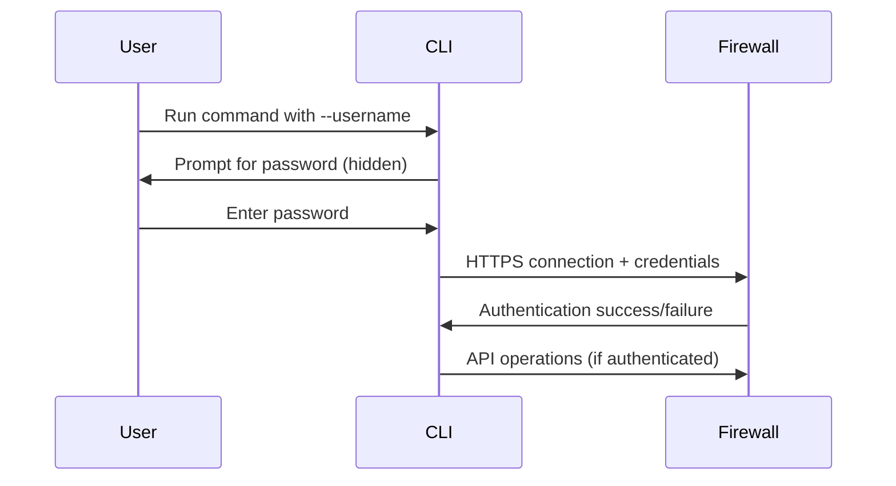

# Architecture Overview

## 🏗️ Design Philosophy

The PAN-OS Upgrade Automation tool is designed with the following principles:

- **Safety First**: Dry-run mode by default, comprehensive validation
- **Modularity**: Component-based architecture for maintainability
- **Extensibility**: Easy to add new device types and features
- **Scalability**: Support for single devices to large-scale deployments
- **Reliability**: Robust error handling and retry mechanisms

## 📁 Project Structure

```
pan_os_upgrade/
├── pan_os_upgrade/              # Main Python package
│   ├── __init__.py             # Package initialization
│   ├── __main__.py             # Entry point for python -m execution
│   ├── main.py                 # CLI interface and command routing
│   ├── components/             # Core functional components
│   │   ├── __init__.py
│   │   ├── firewall.py         # Single firewall operations
│   │   └── snapshots.py        # Network state capture
│   └── models/                 # Data models and configuration
│       ├── __init__.py
│       └── config.py           # Configuration management
├── tests/                      # Test suite
│   ├── __init__.py
│   ├── test_cli.py            # CLI command tests
│   └── test_components.py     # Component unit tests
├── docs/                       # Documentation
│   └── development.md         # Development guidelines
├── docker/                     # Container support
│   └── Dockerfile            # Docker image definition
├── .github/                   # CI/CD workflows
│   └── workflows/
│       └── ci.yml            # Continuous integration
├── examples/                  # Usage examples
├── inventory.yaml.example    # Sample inventory file
├── settings.yaml.example     # Sample settings file
├── requirements.txt          # Python dependencies
├── pyproject.toml           # Package configuration
├── README.md               # Project overview
├── INSTALLATION.md         # Installation guide
├── USAGE.md               # Usage instructions
└── LICENSE                # Apache 2.0 license
```

## 🧩 Core Components

### CLI Interface (`main.py`)

The main CLI entry point built with Click framework:

```python
@click.group()
def cli():
    """PAN-OS Upgrade Automation CLI"""
    pass

@cli.command()
@click.option('--host', required=True)
@click.option('--target-version', required=True) 
@click.option('--dry-run/--no-dry-run', default=True)
def firewall(host, target_version, dry_run):
    """Upgrade a single firewall"""
    # Implementation here
```

**Key Features:**
- Command routing and argument parsing
- Secure password prompting
- Colorized output for better UX
- Dry-run mode enforcement

### Components Package (`components/`)

#### Firewall Component (`firewall.py`)
Handles individual firewall operations:

```python
class FirewallUpgrader:
    def __init__(self, host, credentials, settings):
        self.host = host
        self.credentials = credentials
        self.settings = settings
    
    def upgrade(self, target_version, dry_run=True):
        """Execute firewall upgrade workflow"""
        # 1. Connect and authenticate
        # 2. Perform readiness checks
        # 3. Create configuration backup
        # 4. Take network snapshots
        # 5. Download PAN-OS image
        # 6. Install and reboot (if not dry-run)
        # 7. Verify post-upgrade state
        # 8. Generate reports
```

**Responsibilities:**
- Device connectivity and authentication
- Pre-flight readiness checks
- Configuration backup and restore
- PAN-OS download and installation
- Post-upgrade verification
- Error handling and retry logic

#### Snapshots Component (`snapshots.py`)
Captures and compares network state:

```python
class NetworkSnapshots:
    def __init__(self, device_connection):
        self.connection = device_connection
    
    def capture_pre_upgrade(self):
        """Capture state before upgrade"""
        return {
            'routing_table': self._get_routes(),
            'interfaces': self._get_interfaces(),
            'sessions': self._get_sessions(),
            'system_info': self._get_system_info()
        }
    
    def capture_post_upgrade(self):
        """Capture state after upgrade"""
        # Similar to pre_upgrade
    
    def generate_diff_report(self, pre, post):
        """Generate PDF comparison report"""
        # Create visual diff report
```

**Features:**
- Before/after state capture
- Routing table snapshots
- Interface status monitoring
- Active session tracking
- PDF report generation

### Models Package (`models/`)

#### Configuration Management (`config.py`)
Handles YAML configuration files:

```python
@dataclass
class FirewallConfig:
    hostname: str
    ip: str
    username: str
    model: str
    current_version: str
    ha_mode: str

@dataclass  
class Settings:
    dry_run_default: bool
    retry_count: int
    concurrency: int
    backup_config: bool
    pre_post_snapshots: bool

class ConfigManager:
    def load_inventory(self, path: str) -> List[FirewallConfig]:
        """Load firewall inventory from YAML"""
    
    def load_settings(self, path: str) -> Settings:
        """Load settings from YAML"""
```

**Purpose:**
- Type-safe configuration models
- YAML file parsing and validation
- Configuration defaults and overrides

## 🔄 Workflow Architecture

### Single Firewall Upgrade Flow



### Batch Upgrade Flow (via Panorama)



## 🔒 Security Architecture

### Authentication Flow


### Credential Management
- Passwords prompted securely (not logged)
- Support for environment variables
- Future: API key and certificate authentication
- Audit logging for compliance

## 🚀 Performance Architecture

### Concurrent Operations
```python
class ConcurrentUpgrader:
    def __init__(self, max_workers=5):
        self.executor = ThreadPoolExecutor(max_workers=max_workers)
        
    def upgrade_multiple(self, firewalls, target_version):
        futures = []
        for fw in firewalls:
            future = self.executor.submit(self._upgrade_single, fw, target_version)
            futures.append(future)
        
        return [f.result() for f in futures]
```

**Scalability Features:**
- Configurable concurrency limits
- Thread pool for parallel operations
- Progress tracking and rate limiting
- Resource usage monitoring

## 📊 Data Flow Architecture

### Configuration Data
```
inventory.yaml → ConfigManager → FirewallConfig objects → Components
settings.yaml → ConfigManager → Settings object → Global behavior
```

### Runtime Data
```
CLI Input → Validation → Component Execution → Results → Reports
```

### Backup Data
```
Device Config → XML/JSON → Local Storage → Audit Trail
Network State → Structured Data → PDF Reports → Change Documentation
```

## 🔧 Extension Points

### Adding New Device Types
1. Create new component in `components/`
2. Extend CLI with new command
3. Add device-specific configuration models
4. Implement common interface methods

### Adding New Features
1. Add configuration options to `settings.yaml`
2. Update Settings model
3. Implement feature in appropriate component
4. Add CLI options if needed

### Custom Reporting
1. Extend snapshots component
2. Create new report generators
3. Add configuration for report types
4. Integrate with existing workflow

## 🧪 Testing Architecture

### Test Organization
```
tests/
├── unit/                   # Component unit tests
│   ├── test_firewall.py
│   ├── test_snapshots.py
│   └── test_config.py
├── integration/           # Integration tests
│   ├── test_upgrade_flow.py
│   └── test_cli_commands.py
└── fixtures/              # Test data
    ├── mock_responses/
    └── sample_configs/
```

### Testing Strategy
- **Unit Tests**: Individual component functionality
- **Integration Tests**: End-to-end command execution
- **Mock Tests**: External API interactions
- **Fixture Tests**: Configuration parsing and validation

## 📈 Monitoring & Observability

### Logging Architecture
```python
import logging

logger = logging.getLogger(__name__)

class UpgradeLogger:
    def __init__(self, config):
        self.setup_logging(config)
    
    def setup_logging(self, config):
        # Configure file and console handlers
        # Set appropriate log levels
        # Add structured logging for important events
```

### Metrics Collection
- Upgrade success/failure rates
- Performance timing metrics  
- Error categorization
- Resource utilization

### Audit Trail
- All actions logged with timestamps
- Configuration change tracking
- User action attribution
- Compliance reporting support

## 🔄 Future Enhancements

### Planned Features
- **Web UI**: Browser-based interface for easier management
- **API Server**: REST API for integration with other tools
- **Plugin System**: Third-party extension support
- **Cloud Integration**: AWS/Azure/GCP deployment support
- **Enhanced HA**: Active-active cluster support

### Architecture Improvements
- **Microservices**: Break into smaller, focused services
- **Message Queue**: Async processing with Redis/RabbitMQ
- **Database**: Persistent storage for history and state
- **Containerization**: Full Docker and Kubernetes support

---

This architecture provides a solid foundation for safe, scalable, and maintainable PAN-OS upgrade automation while allowing for future growth and enhancement.